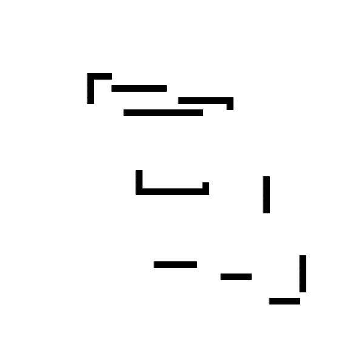
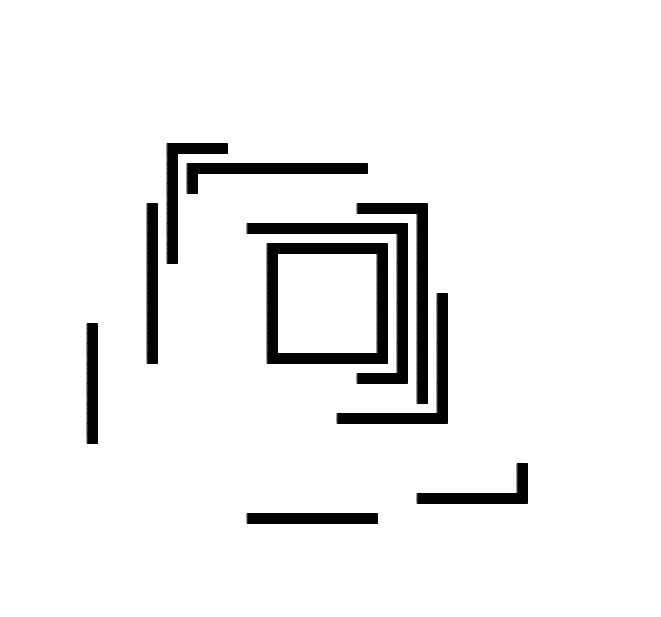
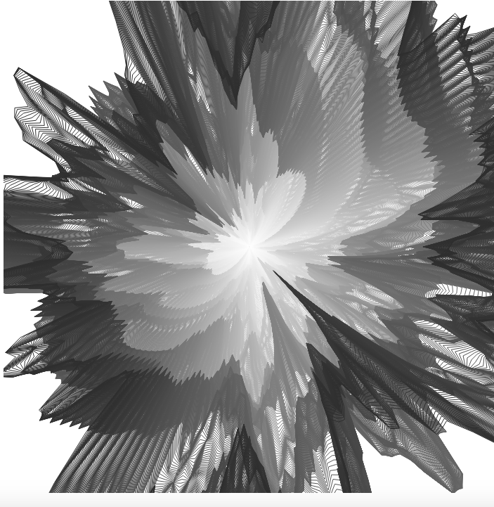
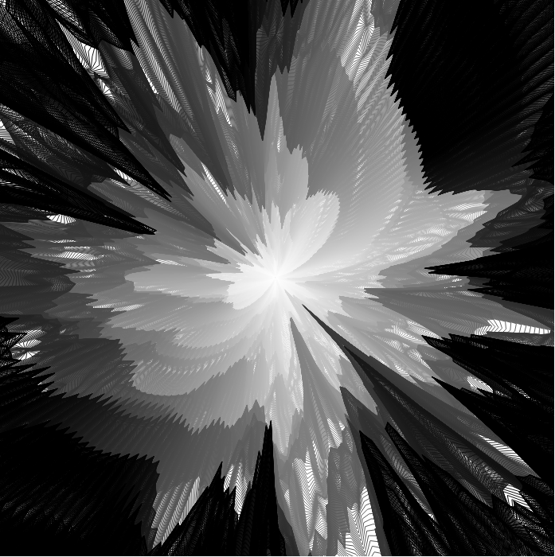
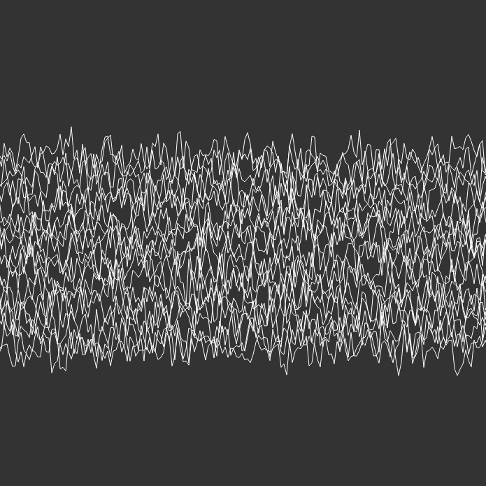
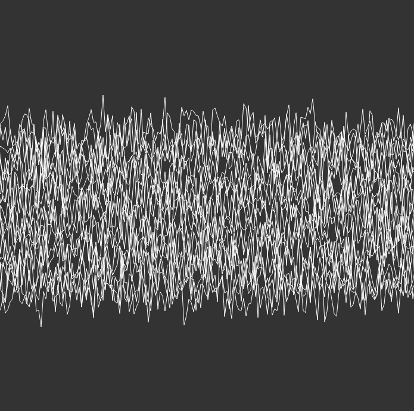

# Final Project: Interactions 

## Proposal

### Conceptual Description
I am interested in simple geometric images, where elements interact to create abstract images. Everything in our world is connected one way or another, be it through social interactions, physics or climate. Separately, the pattern might not be obvious, but taken together it starts to emerge. 

### Interaction Description

I do not plan to make interaction a central piece of my work. 

### Extension

Part of my work would come from extending the previous sketches - triangles and snake. From the snake I want to take the part that controlled the movement and generation of the snake object and transform it into independent art. Extension of the triangles is more symbolic, as I want to create something relatively similar or include it into my final project portfolio. 

### Sketch

  
  
  

### Technical Details / Process

Libraries I will be using: p5js 
Hosting Platform will be Github Pages. 

The creation of this final sketch was iterative - I tried different sketches, until I found the three I like - the ones that go together in terms of the style and represent the theme of Interactions.

#### Some of the sketches I created for the exam but did not use:

https://ksenia007.github.io/sketch3final/

https://ksenia007.github.io/rotation/

https://ksenia007.github.io/rotatingLines/

### Result

My first piece: **It all connects

https://ksenia007.github.io/finalGraphicsSketch1/

For me, this piece represents interactions because the randomly positioned squares eventually form squares, each one folded inside each other. And without the central squares it would take more time to understand the pattern of the outer lines. 

  
  

My second piece: **Noise in the tunnel**

https://ksenia007.github.io/noiseTunnel/

It is based on the idea of Perlin noise rings (I was inspired by the Jacob Joaquin "Solar Flare" Processing 3.3 code for the implementation). Taken apart, they are just noisy rings. However, looking at the consequtive formation, we see a tunnel appearing. 

  
  

My third piece: **Pulse it**

https://ksenia007.github.io/waveMiddle/

Once again, it is based on the Perlin noise. Every line is formed separately, and taken as a separate entity the pattern would not be obvious. But shown together as a line we see a pulsation. 

  
  

