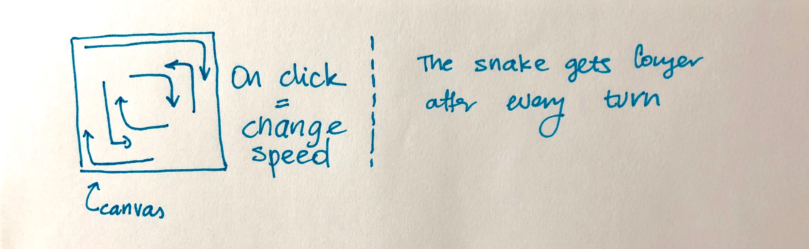
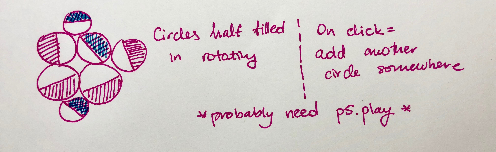
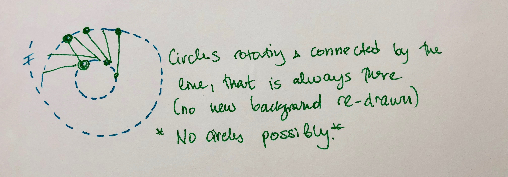

# Final Project

## Proposal

### Conceptual Description
I am interested in simple geometric images, where elements interact with other to create abstract images. 

### Interaction Description

I do not plan to make interaction a central piece of my work. However, I plan to let user change some property of the sketch. 

### Extension

Part of my work would come from extending the previous sketches - triangles and snake. From the snake I want to take the part that controlled the movement and generation of the snake object and transform it into independent art. Extension of the triangles is more symbolic, as I want to create something relatively similar or include it into my final project portfolio. 

### Sketch

  
  
  

### Technical Details

Libraries I will be using: p5js and possibly p5.play

Hosting Platform will be Github Pages. 
